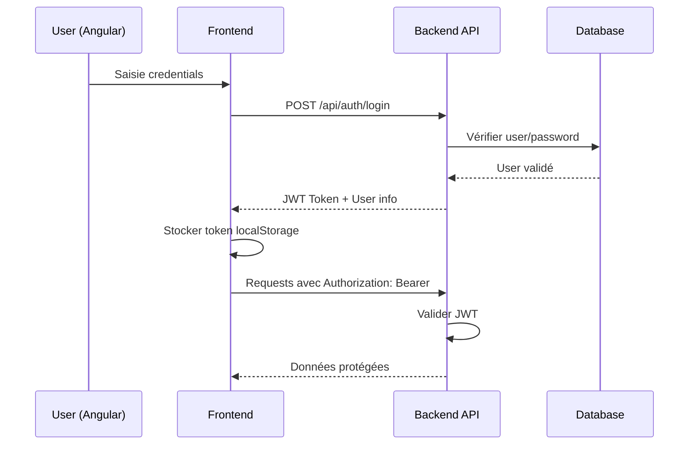

# 🚀 Système de Suivi et d'Évaluation de Projets (SSE) - Full Stack


**Application complète de gestion de projets avec backend REST API Spring Boot et frontend Angular moderne.**

---

## 📋 **Table des Matières**

- [🎯 Vue d'ensemble](#-vue-densemble)
- [🏗️ Architecture Full Stack](#️-architecture-full-stack)
- [🔧 Backend - API REST](#-backend---api-rest)
- [🎨 Frontend - Angular](#-frontend---angular)
- [🚀 Installation et Démarrage](#-installation-et-démarrage)
- [🔐 Authentification JWT](#-authentification-jwt)
- [📊 API Documentation](#-api-documentation)
- [🧪 Tests et Validation](#-tests-et-validation)
- [🚢 Déploiement](#-déploiement)

---

## 🎯 **Vue d'ensemble**

### **Système complet de gestion de projets comprenant :**
- **Backend Spring Boot** avec API REST sécurisée
- **Frontend Angular** avec interface moderne et responsive
- **Authentification JWT** intégrée
- **Base de données PostgreSQL** avec relations complexes
- **Documentation Swagger** interactive
- **Guards et interceptors** pour la sécurité

### **🔥 Fonctionnalités Principales**
- ✅ **Gestion complète des projets** (CRUD + suivi)
- ✅ **Système de tâches** avec statuts et échéances
- ✅ **Rapports automatisés** et manuels
- ✅ **Indicateurs de performance** (KPIs)
- ✅ **Gestion d'utilisateurs** avec rôles
- ✅ **Évaluateurs** et système d'évaluation
- ✅ **Interface responsive** avec Material Design
- ✅ **Authentification sécurisée** avec JWT

---

## 🏗️ **Architecture Full Stack**

```
┌─────────────────────┐    HTTP/REST API    ┌─────────────────────┐
│                     │◄──────────────────►│                     │
│   FRONTEND ANGULAR  │                     │  BACKEND SPRING     │
│                     │      JWT Auth       │                     │
│  ┌─────────────────┐│                     │  ┌─────────────────┐│
│  │   Components    ││                     │  │   Controllers   ││
│  │   - Dashboard   ││                     │  │   - AuthController│
│  │   - Projets     ││                     │  │   - ProjetController│
│  │   - Tâches      ││                     │  │   - TacheController││
│  │   - Users       ││                     │  │   - UserController││
│  └─────────────────┘│                     │  └─────────────────┘│
│  ┌─────────────────┐│                     │  ┌─────────────────┐│
│  │    Services     ││                     │  │    Services     ││
│  │   - AuthService ││                     │  │   - UserService ││
│  │   - ApiService  ││                     │  │   - ProjetService││
│  └─────────────────┘│                     │  └─────────────────┘│
│  ┌─────────────────┐│                     │  ┌─────────────────┐│
│  │     Guards      ││                     │  │   Repositories  ││
│  │   - AuthGuard   ││                     │  │   - UserRepo    ││
│  │   - NoAuthGuard ││                     │  │   - ProjetRepo  ││
│  └─────────────────┘│                     │  └─────────────────┘│
└─────────────────────┘                     └─────────────────────┘
                                                       │
                                                       │ JPA/Hibernate
                                                       ▼
                                            ┌─────────────────────┐
                                            │                     │
                                            │   POSTGRESQL DB     │
                                            │                     │
                                            │  ┌─────────────────┐│
                                            │  │     Tables      ││
                                            │  │   - users       ││
                                            │  │   - projets     ││
                                            │  │   - taches      ││
                                            │  │   - rapports    ││
                                            │  │   - indicateurs ││
                                            │  └─────────────────┘│
                                            └─────────────────────┘
```

---

## 🔧 **Backend - API REST**

### **🛠️ Technologies Backend**
- **Spring Boot 3.2** - Framework principal
- **Spring Security** - Sécurité et authentification
- **Spring Data JPA** - Persistence et ORM
- **PostgreSQL** - Base de données relationnelle
- **JWT (JsonWebToken)** - Authentification stateless
- **Swagger/OpenAPI** - Documentation API
- **Maven** - Gestion des dépendances

### **📊 Statistiques Backend**
```
📁 Backend Structure:
├── 📂 Controllers (6)     : AuthController, ProjetController, TacheController, etc.
├── 📂 Services (8)        : UserService, ProjetService, AuthService, etc.
├── 📂 Repositories (6)    : UserRepository, ProjetRepository, etc.
├── 📂 Models/Entities (6) : User, Projet, Tache, Rapport, etc.
├── 📂 DTOs (12)          : LoginRequest, JwtResponse, RegisterRequest, etc.
├── 📂 Security (4)       : JwtUtils, AuthTokenFilter, SecurityConfig, etc.
└── 📂 Configuration (3)  : CORS, Jackson, Database Config

📈 API Endpoints: 53+ endpoints
🔒 Authentication: JWT + Role-based access
📚 Documentation: Swagger UI + OpenAPI 3.0
```

### **🎯 Endpoints Principaux Backend**

| Module | Endpoints | Sécurité | Fonctionnalités |
|--------|-----------|----------|-----------------|
| **Auth** | 8 endpoints | Public/JWT | Login, Register, Profile |
| **Projets** | 10 endpoints | 🔒 Role-based | CRUD, Search, Stats |
| **Tâches** | 14 endpoints | 🔒 JWT | CRUD, Status, Retard |
| **Rapports** | 12 endpoints | 🔒 JWT | CRUD, Génération auto |
| **Utilisateurs** | 9 endpoints | 🔒 Admin | Gestion utilisateurs |
| **Indicateurs** | 7 endpoints | 🔒 JWT | KPIs, Métriques |

---

## 🎨 **Frontend - Angular**

### **🛠️ Technologies Frontend**
- **Angular 17** - Framework frontend moderne
- **TypeScript 5.0** - Langage typé
- **Angular Material** - UI Components
- **RxJS** - Programmation réactive
- **Angular Router** - Navigation et guards
- **HTTP Client** - Communication avec l'API
- **JWT Interceptor** - Authentification automatique

### **📱 Structure Frontend**

```
src/app/
├── 🔐 authentication/
│   ├── sign-in.component.ts      # Connexion
│   └── sign-up.component.ts      # Inscription
├── 🛡️ guards/
│   ├── auth.guard.ts             # Protection routes authentifiées
│   ├── no-auth.guard.ts          # Éviter accès si connecté
│   └── redirect.guard.ts         # Redirection intelligente
├── 🎨 layout/
│   └── layout.component.ts       # Layout principal avec navigation
├── 📊 dashboard/
│   └── dashboard.component.ts    # Tableau de bord
├── 📋 projets/
│   ├── projet-list.component.ts  # Liste des projets
│   ├── projet-detail.component.ts # Détails projet
│   └── projet-form.component.ts  # Formulaire projet
├── ✅ taches/
│   ├── tache-list.component.ts   # Liste des tâches
│   └── tache-form.component.ts   # Formulaire tâche
├── 📄 rapports/
│   ├── rapport-list.component.ts # Liste des rapports
│   └── rapport-form.component.ts # Formulaire rapport
├── 👥 users/
│   └── user-list.component.ts    # Gestion utilisateurs
├── 🎯 evaluateurs/
│   └── evaluateur-list.component.ts # Gestion évaluateurs
└── 📈 indicateurs/
    └── indicateur-list.component.ts # Indicateurs KPIs
```

### **🎯 Fonctionnalités Frontend**

#### **🔐 Authentification & Sécurité**
- ✅ **Connexion/Déconnexion** avec JWT
- ✅ **Inscription** nouveaux utilisateurs
- ✅ **Guards de routes** (AuthGuard, NoAuthGuard)
- ✅ **Intercepteur HTTP** pour tokens automatiques
- ✅ **Gestion d'erreurs** centralisée
- ✅ **Redirection intelligente** après connexion

#### **📊 Interface Utilisateur**
- ✅ **Material Design** moderne et responsive
- ✅ **Navigation** avec menu latéral
- ✅ **Tableaux** avec tri et filtrage
- ✅ **Formulaires réactifs** avec validation
- ✅ **Notifications** toast pour feedback
- ✅ **Loading states** et spinners

#### **🚀 Routing & Navigation**

```typescript
// Routes principales
/sign-in          # Connexion
/sign-up          # Inscription
/app/dashboard    # Tableau de bord (protégé)
/app/projets      # Liste projets (protégé)
/app/taches       # Liste tâches (protégé)
/app/rapports     # Liste rapports (protégé)
/app/users        # Gestion utilisateurs (admin)
```

---

## 🚀 **Installation et Démarrage**

### **📋 Prérequis**
- **Java 17+** ☕
- **Node.js 18+** & **npm** 📦
- **PostgreSQL 13+** 🐘
- **Git** 🔄
- **IDE** (IntelliJ IDEA / VS Code) 💻

### **🗄️ 1. Configuration Base de Données**

```sql
-- Créer la base de données
CREATE DATABASE sseprojet;
CREATE USER sseuser WITH PASSWORD 'ssepassword';
GRANT ALL PRIVILEGES ON DATABASE sseprojet TO sseuser;
```

### **⚙️ 2. Configuration Backend**

```bash
# Cloner le projet
git clone <votre-repo>
cd sseprojet

# Configuration application.properties
cp src/main/resources/application.properties.example src/main/resources/application.properties

# Éditer les propriétés de DB
spring.datasource.url=jdbc:postgresql://localhost:5432/sseprojet
spring.datasource.username=sseuser
spring.datasource.password=ssepassword
```

### **🎨 3. Configuration Frontend**

```bash
# Aller dans le dossier frontend
cd sseprojet-frontend

# Installer les dépendances
npm install

# Configuration de l'API (si nécessaire)
# Vérifier src/app/core/services/api.service.ts
# API_BASE = 'http://localhost:8080/api'
```

### **🚀 4. Démarrage Full Stack**

#### **Backend (Terminal 1) :**
```bash
# Dans le dossier racine du projet
./mvnw clean install
./mvnw spring-boot:run

# L'API sera disponible sur http://localhost:8080
# Swagger UI : http://localhost:8080/swagger-ui/index.html
```

#### **Frontend (Terminal 2) :**
```bash
# Dans le dossier sseprojet-frontend
ng serve

# L'application sera disponible sur http://localhost:4200
```

### **✅ 5. Vérification du Démarrage**

#### **Backend :**
```bash
# Test API
curl http://localhost:8080/api/auth/test
# Réponse attendue : "API d'authentification fonctionne !"
```

#### **Frontend :**
- Ouvrir http://localhost:4200
- Page de connexion doit s'afficher
- Tenter connexion avec : admin@sseprojet.com / admin123

---

## 🔐 **Authentification JWT - Intégration Complète**

### **🔄 Workflow d'Authentification**



### **🔑 Configuration JWT Frontend**

#### **Service d'Authentification Angular :**
```typescript
// src/app/core/services/auth.service.ts
@Injectable({
  providedIn: 'root'
})
export class AuthService {
  private readonly API_BASE = 'http://localhost:8080/api';
  
  login(credentials: LoginRequest): Observable<JwtResponse> {
    return this.http.post<JwtResponse>(`${this.API_BASE}/auth/login`, credentials)
      .pipe(
        tap(response => {
          localStorage.setItem('token', response.token);
          localStorage.setItem('currentUser', JSON.stringify(response));
          this.currentUserSubject.next(response);
        })
      );
  }
}
```

#### **Intercepteur JWT :**
```typescript
// src/app/core/interceptors/jwt.interceptor.ts
export class JwtInterceptor implements HttpInterceptor {
  intercept(request: HttpRequest<any>, next: HttpHandler): Observable<HttpEvent<any>> {
    const token = this.authService.getToken();
    
    if (token) {
      request = request.clone({
        setHeaders: {
          Authorization: `Bearer ${token}`
        }
      });
    }
    return next.handle(request);
  }
}
```

#### **Guards de Protection :**
```typescript
// src/app/guards/auth.guard.ts
export const authGuard: CanActivateFn = (route, state) => {
  const authService = inject(AuthService);
  const router = inject(Router);

  if (authService.isAuthenticated()) {
    return true;
  }

  router.navigate(['/sign-in'], { queryParams: { returnUrl: state.url } });
  return false;
};
```

### **🎯 Endpoints d'Authentification**

| Endpoint | Méthode | Frontend Route | Description |
|----------|---------|----------------|-------------|
| `/api/auth/login` | POST | `/sign-in` | Connexion utilisateur |
| `/api/auth/register` | POST | `/sign-up` | Inscription |
| `/api/auth/me` | GET | - | Profil utilisateur connecté |
| `/api/auth/logout` | POST | - | Déconnexion (optionnel) |

---

## 📊 **API Documentation - Swagger Integration**

### **📚 Documentation Interactive**
- **Swagger UI :** http://localhost:8080/swagger-ui/index.html
- **OpenAPI JSON :** http://localhost:8080/v3/api-docs
- **Postman Collection :** Exportable depuis Swagger

### **🧪 Tests API avec Swagger**

#### **1. Authentification :**
```bash
# 1. Tester connexion
POST /api/auth/login
{
  "email": "admin@sseprojet.com",
  "motDePasse": "admin123"
}

# 2. Copier le token JWT reçu

# 3. Cliquer "Authorize" dans Swagger
# 4. Coller : Bearer {votre_token}

# 5. Tester endpoints protégés
GET /api/projets
GET /api/auth/me
```

### **📋 Collection Postman Complète**

#### **🗂️ Dossiers d'API :**

**Authentication (8 endpoints) :**
- POST Login
- POST Register  
- GET Profile
- GET Test API

**Projets (10 endpoints) :**
- GET All Projects
- POST Create Project
- GET Project by ID
- PUT Update Project

**Tâches (14 endpoints) :**
- GET All Tasks
- POST Create Task
- PATCH Update Status
- GET Tasks by Project

**Full Stack Examples :**
```json
// Variables Postman
{
  "backend_url": "http://localhost:8080/api",
  "frontend_url": "http://localhost:4200",
  "jwt_token": "{{login_token}}"
}
```

---

## 🧪 **Tests et Validation Full Stack**

### **🎯 Scénarios de Test Complets**

#### **Scenario 1 : Connexion & Navigation**
1. **Frontend :** Ouvrir http://localhost:4200
2. **Redirection :** Automatique vers `/sign-in`
3. **Connexion :** admin@sseprojet.com / admin123
4. **JWT :** Token stocké en localStorage
5. **Redirection :** Vers `/app/dashboard`
6. **API Calls :** Automatiques avec Authorization header

#### **Scenario 2 : CRUD Projets**
1. **Navigation :** `/app/projets`
2. **Chargement :** GET `/api/projets` avec JWT
3. **Création :** Formulaire → POST `/api/projets`
4. **Mise à jour :** Liste rafraîchie automatiquement
5. **Détails :** Click → GET `/api/projets/{id}`

#### **Scenario 3 : Gestion Erreurs**
1. **Token expiré :** Interceptor détecte 401
2. **Redirection :** Automatique vers login
3. **Message :** "Session expirée"
4. **Reconnexion :** Nouveau token
5. **Retour :** À la page précédente

### **✅ Points de Validation**

#### **Backend :**
- ✅ Tous les endpoints répondent (53+)
- ✅ JWT valide et sécurise les routes
- ✅ CORS configuré pour Angular
- ✅ Validation données avec Bean Validation
- ✅ Gestion d'erreurs avec codes HTTP appropriés

#### **Frontend :**
- ✅ Routes protégées par guards
- ✅ Token injecté automatiquement
- ✅ UI responsive et moderne
- ✅ Formulaires avec validation
- ✅ Gestion d'erreurs utilisateur

#### **Intégration :**
- ✅ Communication seamless Backend ↔ Frontend
- ✅ Authentification transparente
- ✅ Données temps réel
- ✅ Performance optimisée

---

## 🚢 **Déploiement**

### **🐳 Docker Compose Full Stack**

```yaml
# docker-compose.yml
version: '3.8'
services:
  database:
    image: postgres:15
    environment:
      POSTGRES_DB: sseprojet
      POSTGRES_USER: sseuser
      POSTGRES_PASSWORD: ssepassword
    ports:
      - "5432:5432"
    volumes:
      - postgres_data:/var/lib/postgresql/data

  backend:
    build: ./
    ports:
      - "8080:8080"
    environment:
      SPRING_DATASOURCE_URL: jdbc:postgresql://database:5432/sseprojet
      SPRING_DATASOURCE_USERNAME: sseuser
      SPRING_DATASOURCE_PASSWORD: ssepassword
    depends_on:
      - database

  frontend:
    build: ./sseprojet-frontend
    ports:
      - "80:80"
    depends_on:
      - backend

volumes:
  postgres_data:
```

### **☁️ Variables d'Environnement Production**

#### **Backend :**
```bash
# Production
SPRING_PROFILES_ACTIVE=prod
SPRING_DATASOURCE_URL=jdbc:postgresql://prod-db:5432/sseprojet
JWT_SECRET=your-256-bit-production-secret-key
JWT_EXPIRATION=3600000
CORS_ALLOWED_ORIGINS=https://your-frontend-domain.com
```

#### **Frontend :**
```typescript
// src/environments/environment.prod.ts
export const environment = {
  production: true,
  apiUrl: 'https://your-backend-api.com/api',
  appName: 'SSE Projet'
};
```

---

## 🎯 **Roadmap & Améliorations**

### **🔄 Version Actuelle (v1.0)**
- ✅ Backend API REST complet (53+ endpoints)
- ✅ Frontend Angular avec Material Design
- ✅ Authentification JWT sécurisée
- ✅ CRUD complet toutes entités
- ✅ Documentation Swagger intégrée

### **🚀 Prochaines Fonctionnalités (v1.1)**
- 🔄 **Notifications temps réel** (WebSocket)
- 📊 **Dashboard analytics** avancé avec graphiques
- 📱 **App mobile** (Ionic ou React Native)
- 🔍 **Recherche globale** multi-entités
- 📧 **Notifications email** automatiques

### **⚡ Optimisations (v1.2)**
- 🗄️ **Cache Redis** pour performances
- 📄 **Pagination** avancée côté frontend
- 🔒 **OAuth2** intégration (Google, Microsoft)
- 📱 **PWA** support offline
- 🧪 **Tests automatisés** E2E

---

## 🤝 **Contribution**

### **💻 Development Guidelines**

#### **Backend :**
```bash
# Conventions de nommage
Controllers: {Entity}Controller.java
Services: {Entity}Service.java
DTOs: {Entity}DTO.java / {Action}Request.java

# Tests
mvn test                    # Tests unitaires
mvn verify                  # Tests d'intégration
```

#### **Frontend :**
```bash
# Conventions Angular
Components: {feature}-{type}.component.ts
Services: {feature}.service.ts
Guards: {type}.guard.ts

# Tests & Lint
ng test                     # Tests unitaires
ng e2e                      # Tests E2E
ng lint                     # Linter
ng build --prod            # Build production
```

### **📝 Pull Request Process**
1. Fork du projet
2. Branch feature : `git checkout -b feature/ma-fonctionnalite`
3. Tests passants : Backend + Frontend
4. Documentation mise à jour
5. Pull Request avec description détaillée

---

## 📞 **Support & Documentation**

### **🔗 Liens Utiles**
- **API Documentation :** http://localhost:8080/swagger-ui/index.html
- **Frontend App :** http://localhost:4200
- **Database Admin :** pgAdmin ou DBeaver
- **Postman Collection :** Exportable depuis Swagger

### **🆘 Troubleshooting**

#### **Backend ne démarre pas :**
```bash
# Vérifier PostgreSQL
sudo systemctl status postgresql
# Vérifier port 8080
netstat -tulpn | grep 8080
# Logs détaillés
./mvnw spring-boot:run --debug
```

#### **Frontend ne se connecte pas :**
```bash
# Vérifier CORS dans SecurityConfig.java
# Vérifier URL API dans environment.ts
# Console navigateur pour erreurs CORS
```

#### **JWT ne fonctionne pas :**
```bash
# Vérifier token dans localStorage
localStorage.getItem('token')
# Vérifier format Authorization header
# Tester token sur jwt.io
```

---

## 📊 **Métriques du Projet**

```
📈 Statistiques Full Stack:
├── 📁 Backend (Java/Spring)
│   ├── 🎯 Endpoints API: 53+
│   ├── 📋 Controllers: 6
│   ├── 🔧 Services: 8  
│   ├── 🗄️ Repositories: 6
│   ├── 📊 Entities: 6
│   ├── 📝 DTOs: 15+
│   └── 🔒 Security Classes: 4
├── 📁 Frontend (Angular/TypeScript)
│   ├── 🎨 Components: 15+
│   ├── 🔧 Services: 8
│   ├── 🛡️ Guards: 3
│   ├── 📱 Pages/Routes: 12
│   └── 🎯 Interceptors: 2
└── 📊 Total LOC: ~15,000 lignes
```

**🎉 Votre application SSE Full Stack est maintenant complète et prête pour la production !**

---

*Dernière mise à jour : 06 Août 2025*
*Version : 1.0.0 - Full Stack Integration*


